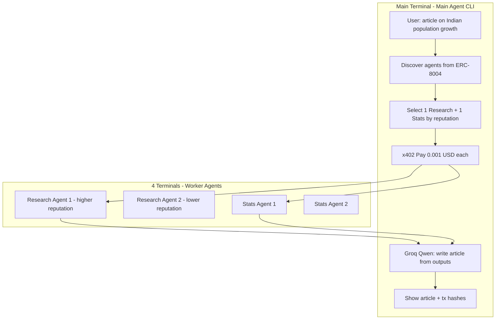

# 4-Agent Article Pipeline: Research + Stats + Main (Qwen)

## Goal

- **User prompt (main terminal):** "I need to write an article on the growth of Indian population."
- **Main agent:** Discovers 4 registered agents, selects **one research agent** (highest reputation among research) and **one statistical analytics agent** (highest reputation among stats), pays each **0.001 USD** via x402, receives their outputs, then uses **Groq Qwen reasoning** (`qwen/qwen3-32b`) to write the article and prints it in the main terminal.
- **4 worker agents** run in **4 separate terminals**, each with **clear logs**; two are research agents (with different reputation scores), two are statistical analytics agents.

---

## Architecture



---

## 1. Worker Agents (4 terminals) — Facinet-based

**We should (and will) make the worker side Facinet-based.** The [Facinet SDK](https://facinet.vercel.app/docs#sdk-reference) provides **paywall middleware** that returns HTTP 402 when no payment is provided and automatically verifies/settles payments when the client retries with X-PAYMENT. No custom x402 server or direct PayAI integration needed on workers.

**Roster:**

| Terminal | Agent type              | Role                          | Reputation (seeded) |
|----------|-------------------------|-------------------------------|----------------------|
| 1        | Research                | Research agent (higher rep)   | e.g. 92              |
| 2        | Research                | Research agent (lower rep)    | e.g. 70              |
| 3        | Statistical analytics   | Stats agent 1                 | e.g. 88              |
| 4        | Statistical analytics   | Stats agent 2                 | e.g. 85              |

**Each worker:**

- **Stack:** Node/TS, **Express**, [facinet-sdk](https://facinet.vercel.app/docs#sdk-reference) (`npm install facinet-sdk`).
- **Payment:** Use Facinet's **`paywall({ amount, recipient })`** Express middleware. It returns **402** when no payment header is present, and verifies/settles via Facinet's API (`/api/x402/verify`, `/api/x402/settle`) when the client retries with **X-PAYMENT**. Payment proof is on **`req.x402`** so the route handler can log tx hash and run the agent logic.
- **Price:** `amount: '0.001'` (0.001 USD) per request; `recipient` = worker's wallet address.
- **Example (from Facinet docs):**
  ```js
  import { paywall } from 'facinet-sdk'
  app.get('/task', paywall({ amount: '0.001', recipient: '0xYourWallet...' }), (req, res) => {
    // req.x402 contains payment proof (e.g. tx hash after settlement)
    const query = req.query.query || 'Indian population growth'
    // ... run research or stats logic ...
    res.json({ result: '...' })
  })
  ```
- **Clear logging:** Log request received, 402 sent (by middleware), payment verified (`req.x402`), execution start/end, result length, 200 sent.

**Research agent logic:** Call Groq (or local LLM) to produce a short “research summary” on Indian population growth (key facts, sources, trends). Log the prompt and that execution started/finished.

**Stats agent logic:** Produce a short “statistical summary” (numbers, growth rates, comparisons). Can be mock data or Groq-generated for demo. Log similarly.

**Registration (ERC-8004):**

- Each worker has an **agent registration file** (JSON) with:
  - `name`, `description`, `services[].endpoint` (URL of this worker).
  - `x402Support: true`.
  - A **capability tag** the main agent can use to filter: e.g. `"research"` vs `"statistical-analytics"` (in description or a custom field/tag in metadata or registration file).
- Register each on the official Fuji Identity Registry (`0x8004A818BFB912233c491871b3d84c89A494BD9e`) using facinet or viem, and seed Reputation Registry (`0x8004B663056A597Dffe9eCcC1965A193B7388713`) with `giveFeedback` so the two research agents have different `summaryValue` (e.g. 92 vs 70).

---

## 2. Main Agent (orchestrator)

**Flow:**

1. **User input:** "I need to write an article on the growth of Indian population."
2. **Discover:** Query ERC-8004 Identity + Reputation on Avalanche Fuji; list all 4 agents with reputation.
3. **Classify:** For each agent, infer type from name/description/registration:
   - **Research:** e.g. name/description contains "research".
   - **Statistical analytics:** e.g. "statistical", "stats", "analytics".
4. **Select:**
   - One **research** agent: the one with **highest reputation** among research agents.
   - One **stats** agent: the one with **highest reputation** among stats agents.
5. **Pay and fetch:**
   - Call research agent’s endpoint with x402 (0.001 USD); log tx hash from PAYMENT-RESPONSE.
   - Call stats agent’s endpoint with x402 (0.001 USD); log tx hash.
   - Capture both response bodies.
6. **Write article:** Call **Groq Qwen** (`qwen-qwq-32b`) with:
   - System/user: “You are a writer. Given the following research summary and statistical summary, write a short article on the growth of Indian population. Output only the article, no preamble.”
   - Research summary + stats summary as context.
   - Use [reasoning](https://console.groq.com/docs/model/qwen-qwq-32b): `reasoning_format: "parsed"` (recommended for QwQ-32B to handle missing first `<think>` token) or `"hidden"` to show only the final article.
7. **Output:** Print the article in the main terminal and list all payment tx hashes.

**Groq model:** Use **Qwen 3 32B** for the main agent’s “write article” step (and optionally for task classification if you use LLM there). Reasoning params: `reasoning_format: "hidden"` for clean article output; optionally `reasoning_effort` if exposed for Qwen.

---

## 3. Ngrok vs localhost

**When to use ngrok:**

- **Same machine, all 5 processes on one PC:** Main agent can call workers at `http://localhost:4021`, `http://localhost:4022`, etc. **No ngrok needed** if the registration files’ `services[].endpoint` use `http://localhost:4021` and the main agent runs on the same machine.
- **Different machines or “real” URLs in ERC-8004:** Worker endpoints in registration must be reachable by the main agent. If the main agent runs on another machine (or you want stable public URLs for demos), run **one ngrok tunnel per worker** (e.g. `ngrok http 4021`, `ngrok http 4022`, …) and put the **ngrok HTTPS URLs** in each agent’s registration file and in the Identity Registry’s `agentURI` / `services[].endpoint`.

**Recommendation:**

- **Development / single machine:** Use **localhost** for worker URLs; no ngrok.
- **Demo from one machine but “production-like” URLs:** Use **ngrok** for each of the 4 workers; register those 4 URLs on ERC-8004; main agent calls the ngrok URLs and you get clear worker logs in each terminal.

**Implementation:** Make the worker’s **base URL** configurable (env or flag), e.g. `BASE_URL=http://localhost:4021` or `BASE_URL=https://abc.ngrok.io`. Same code; only registration and main agent’s discovered URLs change.

---

## 4. Clear logs for the two selected workers

**Worker server logging (every request):**

- Incoming: method, path, query, presence of X-PAYMENT.
- If no payment: log “Sending 402 Payment Required (0.001 USD).”
- If payment present: verify/settle; log “Payment settled, txHash=0x...”.
- Log “Executing [Research|Stats] for query: …”.
- After execution: “Result length: N characters.”
- Log “Responding 200 OK.”

**Main agent logging:**

- “Discovered N agents; selected Research: &lt;name&gt; (reputation X), Stats: &lt;name&gt; (reputation Y).”
- “Paying Research agent at &lt;url&gt;… Payment tx: 0x...”
- “Paying Stats agent at &lt;url&gt;… Payment tx: 0x...”
- “Writing article with Groq Qwen…”
- “Article (length N):” then the article and “Transaction hashes: 0x..., 0x...”.

So the **two workers that were actually called** (one research, one stats) will have full request/response and payment logs in their own terminals; the other two terminals stay idle for that run.

---

## 5. Implementation plan (concise)

| # | Component | What to do |
|---|-----------|------------|
| 1 | **Worker server (shared)** | **Facinet-based:** Express app + `paywall({ amount: '0.001', recipient })` from [facinet-sdk](https://facinet.vercel.app/docs#sdk-reference). Middleware handles 402 and verify/settle; handler uses `req.x402`, runs research or stats logic, returns JSON. Configurable port and BASE_URL; clear request/payment/execution logs. |
| 2 | **Research worker** | Same Express + Facinet paywall; capability “research”; handler calls Groq for research summary; run in terminal 1 (port 4021) and terminal 2 (4022). |
| 3 | **Stats worker** | Same Express + Facinet paywall; capability “statistical-analytics”; handler calls Groq for stats summary; run in terminal 3 (4023) and terminal 4 (4024). |
| 4 | **Registration files** | 4 JSON files (or IPFS): name, description, services[].endpoint (localhost or ngrok), x402Support, capability in description or metadata. |
| 5 | **ERC-8004 register + reputation** | Script: register 4 agents on official Fuji Identity Registry (`0x8004A818...`) using facinet.executeContract or viem, set agentURI to registration file; seed Reputation Registry (`0x8004B663...`) so Research1 > Research2 and Stats1 > Stats2. |
| 6 | **Main agent discovery** | Extend discovery to tag agents as “research” vs “statistical-analytics” from name/description (or registration metadata). |
| 7 | **Main agent selection** | Pick one research (max reputation) and one stats (max reputation); if only one type exists, pick best two overall or fail clearly. |
| 8 | **Main agent payment** | Call each selected agent’s endpoint with x402 (0.001 USD); capture body and PAYMENT-RESPONSE tx hash; log in main terminal. |
| 9 | **Main agent article** | Call Groq `qwen-qwq-32b` with research + stats outputs, `reasoning_format: "parsed"` (or `"hidden"`), `temperature=0.6`, `top_p=0.95`, prompt to write article; print article + tx hashes in main terminal. |
| 10 | **Ngrok (optional)** | Document and support BASE_URL per worker; optional script to start 4 ngrok tunnels and print URLs for registration. |

---

## 6. Key files / layout

- **Main agent (existing avaz-x402):** `src/index.ts` (orchestrator), `src/discovery/marketplace.ts` (add capability tagging), `src/split.ts` or new `src/selectAgents.ts` (select one research + one stats by reputation), `src/combine.ts` → replace with “write article” using Qwen.
- **Worker (Facinet-based):** New folder e.g. `workers/`: Express app using **facinet-sdk** `paywall()` middleware; `server.ts` (Express + paywall + route), `research.ts` and `stats.ts` (handlers), `package.json` (facinet-sdk, express, groq-sdk). No custom x402 server or PayAI integration — Facinet handles 402, verify, and settle via [facinet.vercel.app](https://facinet.vercel.app/docs#sdk-reference).
- **Scripts:** `scripts/register-agents.ts` (register 4 agents + seed reputation via facinet or viem), `scripts/start-workers.sh` (run 4 Node processes on ports 4021–4024); optional `scripts/ngrok-start.sh` for tunnels.

---

## 7. Facinet SDK (worker side)

- **Docs:** [Facinet SDK Reference](https://facinet.vercel.app/docs#sdk-reference).
- **Worker payment:** Use **`paywall({ amount, recipient })`** from `facinet-sdk`; it handles 402, verify, and settle. Facinet API: `POST /api/x402/verify`, `POST /api/x402/settle`.
- **Main agent payment:** Continues to use existing x402 client (`@x402/fetch` + `@x402/evm`) to pay worker URLs; workers respond with 402 and then settle via Facinet when the client retries with X-PAYMENT. End-to-end flow stays x402-compatible.

---

## 8. Groq Qwen (reasoning) reference

- Model: **`qwen-qwq-32b`** ([Groq reasoning docs](https://console.groq.com/docs/model/qwen-qwq-32b)).
- For “write article” step: use `reasoning_format: "hidden"` so only the final article is returned; no need to show <think> in the main terminal.
- Optional: use same model for classifying agent type from description (research vs stats) if you want LLM-based selection instead of keyword matching.

This plan gives you: 4 workers in 4 terminals with clear logs, 0.001 USD x402, reputation-based choice of one research + one stats, and a single article written by the main agent with Groq Qwen and displayed in the main terminal, with or without ngrok depending on your run environment.
