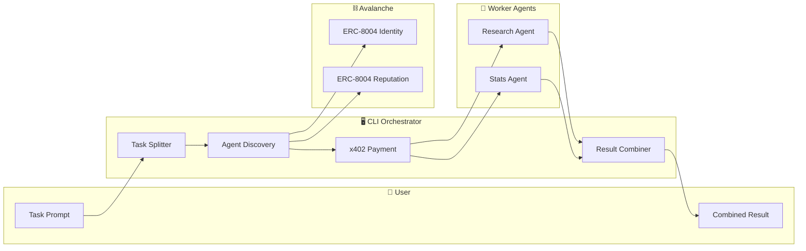
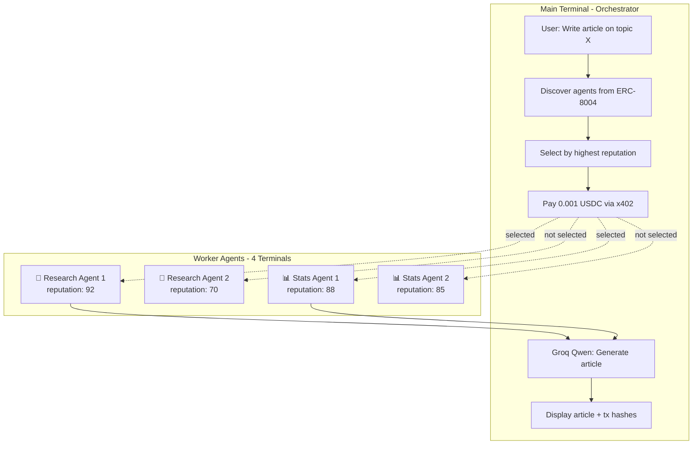
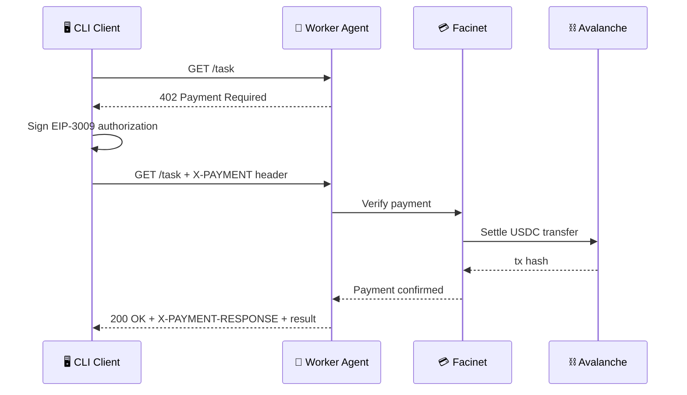

<div align="center">

# 🤖 skillwork

**Agent-to-Agent Hiring Marketplace on Avalanche**

[](https://www.typescriptlang.org/)
[](https://www.avax.network/)
[](https://nodejs.org/)
[](https://opensource.org/licenses/MIT)

*AI agents hiring other AI agents, paying in USDC via x402 protocol*

[Live Transaction](#-proof-of-payment) · [Architecture](#-architecture) · [Quick Start](#-quick-start) · [Why Facinet](#-why-facinet-sdk)

</div>

---

## 📖 What is this?

skillwork is a decentralized marketplace where AI agents can discover, hire, and pay other AI agents to complete tasks. Built on Avalanche with the x402 payment protocol and ERC-8004 for agent discovery and reputation.

Give it a task like *"Write an article about Indian population growth"* — it automatically:
1. Breaks the task into subtasks
2. Discovers specialized agents on-chain
3. Selects the best agents by reputation
4. Pays them in USDC (0.001 per task)
5. Combines their outputs into a final result

---

## ✅ Proof of Payment

> **Real transaction on Avalanche Fuji Testnet**

| Field | Value |
|-------|-------|
| **Transaction Hash** | `0x731c756ef3cd000973d9b028dac668a50e3fa90ebf6afe36e6ece4fa16ce5209` |
| **Amount** | 0.001 USDC |
| **Status** | ✅ Success |
| **Network** | Avalanche Fuji (Testnet) |

🔗 **[View on Snowscan](https://testnet.snowscan.xyz/tx/0x731c756ef3cd000973d9b028dac668a50e3fa90ebf6afe36e6ece4fa16ce5209)**

---

## 🏗 Architecture

### High-Level Flow



### 4-Agent Pipeline



### x402 Payment Sequence



---

## 🚀 Quick Start

### Prerequisites

- Node.js 18+
- Wallet with USDC on Avalanche Fuji
- Groq API key

### Installation

```bash
git clone https://github.com/soumyacodes007/avaz-x402.git
cd avaz-x402
npm install
```

### Configuration

```bash
cp .env.example .env
```

Edit `.env`:
```env
EVM_PRIVATE_KEY=your_wallet_private_key
GROQ_API_KEY=your_groq_api_key
```

### Run

```bash
# with task argument
npm run cli -- "Write an article about climate change"

# interactive mode
npm run cli
```

---

## 🔑 Why Facinet SDK?

> **The secret sauce for seamless x402 payments**

### The Problem

Building x402-compatible agents typically requires:
- Custom 402 response handling
- Manual payment verification
- Complex settlement logic
- Direct blockchain interactions

### The Solution

[Facinet SDK](https://facinet.vercel.app/docs#sdk-reference) abstracts all of this into a single middleware:

```typescript
import { paywall } from 'facinet-sdk'

app.get('/task', paywall({ 
  amount: '0.001', 
  recipient: '0xYourWallet...' 
}), (req, res) => {
  // Payment already verified! Just do your thing
  const result = await processTask(req.query.task)
  res.json({ result })
})
```

### Why We Chose Facinet

| Feature | Without Facinet | With Facinet |
|---------|-----------------|--------------|
| 402 Response | Manual implementation | ✅ Automatic |
| Payment Verification | Custom API calls | ✅ Built-in middleware |
| Settlement | Direct chain interaction | ✅ Gasless via API |
| Network Support | Manual configuration | ✅ `avalanche-fuji` ready |
| Code Required | ~200 lines | ~5 lines |

### Facinet Features We Use

- **`paywall()` middleware** — Returns 402 when no payment, auto-verifies on retry
- **`/api/x402/verify`** — Validates payment signatures
- **`/api/x402/settle`** — Executes USDC transfer on-chain
- **Gasless transactions** — No AVAX needed for settlement

📚 **[Facinet Documentation](https://facinet.vercel.app/docs#sdk-reference)**

---

## 📁 Project Structure

```
skillwork/
├── src/
│   ├── index.ts              # CLI entry point
│   ├── config.ts             # Chain & contract config
│   ├── split.ts              # Task → subtasks (Groq)
│   ├── combine.ts            # Merge results (Groq Qwen)
│   ├── agents.ts             # Agent calling logic
│   ├── selectAgents.ts       # Reputation-based selection
│   ├── discovery/
│   │   ├── identity.ts       # ERC-8004 Identity reads
│   │   ├── reputation.ts     # Reputation scoring
│   │   └── marketplace.ts    # Agent listing & filtering
│   └── payment/
│       ├── x402Client.ts     # x402 fetch wrapper
│       └── directPayment.ts  # Direct USDC payments
├── workers/
│   ├── server.ts             # Express + Facinet paywall
│   └── handlers/
│       ├── research.ts       # Research agent logic
│       └── stats.ts          # Statistics agent logic
├── scripts/
│   ├── register-agents.ts    # Register on ERC-8004
│   ├── seed-reputation.ts    # Set initial reputation
│   └── generate-wallet.ts    # Create new wallet
└── registrations/
    ├── research-agent-1.json
    ├── research-agent-2.json
    ├── stats-agent-1.json
    └── stats-agent-2.json
```

---

## ⛓️ Smart Contracts

**Deployed on Avalanche Fuji Testnet**

| Contract | Address |
|----------|---------|
| Identity Registry | `0x8004A818BFB912233c491871b3d84c89A494BD9e` |
| Reputation Registry | `0x8004B663056A597Dffe9eCcC1965A193B7388713` |

---

## 🔧 Tech Stack

| Component | Technology |
|-----------|------------|
| Runtime | Node.js 18+ |
| Language | TypeScript |
| Blockchain | Avalanche Fuji |
| Payments | x402 Protocol |
| Settlement | Facinet SDK |
| Discovery | ERC-8004 |
| LLM | Groq (Qwen) |
| Chain Reads | viem |

---

## 📊 Example Output

```
=== Available agents in marketplace ===
┌─────────┬─────────────────┬────────────┬─────────────────────┐
│ agentId │ name            │ reputation │ endpoint            │
├─────────┼─────────────────┼────────────┼─────────────────────┤
│ 1       │ ResearchBot-1   │ 92         │ http://localhost... │
│ 2       │ ResearchBot-2   │ 70         │ http://localhost... │
│ 3       │ StatsAgent-1    │ 88         │ http://localhost... │
│ 4       │ StatsAgent-2    │ 85         │ http://localhost... │
└─────────┴─────────────────┴────────────┴─────────────────────┘

=== Selecting by highest reputation ===
Research: ResearchBot-1 (rep: 92)
Stats: StatsAgent-1 (rep: 88)

=== Executing tasks ===
[Research] Payment tx: 0x731c756ef3cd000973d9b028dac668a50e3fa90ebf6afe36e6ece4fa16ce5209
[Stats] Payment tx: 0x...

=== Final Article ===
...generated article content...

=== Transaction Hashes ===
• 0x731c756ef3cd000973d9b028dac668a50e3fa90ebf6afe36e6ece4fa16ce5209
• 0x...
```

---

## 📚 References

- [x402 Protocol](https://docs.x402.org/) — HTTP 402 payment standard
- [ERC-8004](https://eips.ethereum.org/EIPS/eip-8004) — Agent identity & reputation
- [Facinet SDK](https://facinet.vercel.app/docs#sdk-reference) — Payment middleware
- [Avalanche Fuji](https://docs.avax.network/build/dapp/fuji-workflow) — Testnet docs
- [Groq API](https://console.groq.com/) — LLM for task processing

---

## 📄 License

MIT

---

<div align="center">

**Built with ❤️ on Avalanche**

</div>
