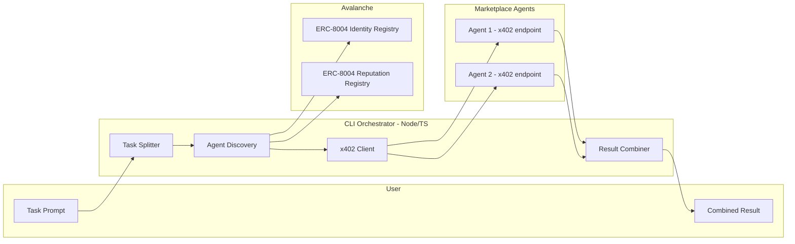

# Agent-to-Agent Hiring Marketplace on Avalanche X402

## Architecture Overview




- **User** enters a task in the CLI.
- **Orchestrator** (single Node/TS CLI): splits task into 2 subtasks, discovers agents (ERC-8004), pays via x402, combines outputs, prints result and **all transaction hashes**.

---

## 1. Tech Stack and Packages


| Layer                | Technology                                               | Purpose                                                                                        |
| -------------------- | -------------------------------------------------------- | ---------------------------------------------------------------------------------------------- |
| Runtime              | Node.js 18+                                              | CLI and payment/settlement (JS/TS requirement)                                                 |
| Language             | TypeScript                                               | Type safety, better SDK usage                                                                  |
| x402 client          | `@x402/fetch` + `@x402/evm`                              | Pay agent endpoints (402 → sign → retry with X-PAYMENT); get `X-PAYMENT-RESPONSE` with tx hash |
| Gasless / direct pay | [facinet-sdk](https://www.npmjs.com/package/facinet-sdk) | Optional: direct USDC pay or settlement endpoint; supports `avalanche-fuji`                    |
| Chain reads          | `viem`                                                   | Read ERC-8004 Identity + Reputation registries on Avalanche Fuji                               |
| CLI                  | `commander` or `inquirer`                                | Parse args, optional interactive prompt                                                        |
| Task splitting       | **Groq AI** (LLM API)                                    | Break user task into 2 subtasks; optionally use Groq for combining results                     |
| Agent calls          | `fetch` wrapped with `wrapFetchWithPayment`              | HTTP calls to agent URLs with automatic x402 handling                                          |


**Why two payment approaches**

- **x402 client (`@x402/fetch` + `@x402/evm`)**: Used when hiring agents that expose an **HTTP endpoint** that returns 402 and accepts `X-PAYMENT`. The CLI is the *client*; the agent (or its facilitator) performs verify/settle. This is the primary flow for “pay per request.”
- **facinet** (see [facinet-sdk.md](facinet-sdk.md) in repo / [npm](https://www.npmjs.com/package/facinet-sdk)): Use for **settlement endpoint** in JS/TS (agent server that receives payment) or **direct USDC pay** via `facinet.pay({ amount, recipient })` and **contract calls** via `facinet.executeContract()` (e.g. 8004 `register`). Supports `avalanche-fuji`; API: `https://facinet.vercel.app`. Install: `npm install facinet`.

---

## 2. ERC-8004 Discovery and Reputation (Official Avalanche Fuji Deployment)

**Official ERC-8004 contracts are deployed on Avalanche Fuji:**

- **Identity Registry**: `0x8004A818BFB912233c491871b3d84c89A494BD9e` ([view on Snowtrace](https://testnet.snowtrace.io/address/0x8004A818BFB912233c491871b3d84c89A494BD9e))
- **Reputation Registry**: `0x8004B663056A597Dffe9eCcC1965A193B7388713` ([view on Snowtrace](https://testnet.snowtrace.io/address/0x8004B663056A597Dffe9eCcC1965A193B7388713))

Use these addresses in `config.ts`. You can register your demo worker agents and seed reputation using these official registries.

**Registry roles:**

- **Identity Registry** (ERC-721): List agents; resolve `agentId` → `agentURI` → registration JSON (name, description, `services[]`, `x402Support`, `registrations`).
- **Reputation Registry**: Use `getSummary(agentId, clientAddresses[], tag1, tag2)` for `(count, summaryValue, summaryValueDecimals)` to rank agents. Use a non-empty `clientAddresses` (per EIP-8004 security).

**Flow:** Query the official Fuji Identity registry → fetch registration files → filter by `x402Support` → query Reputation for each candidate → sort by `summaryValue` → pick **highest-reputation** agents for the two subtasks.

---

## 3. x402 Payment Flow (Client Side in CLI)

1. CLI calls agent endpoint (e.g. `GET https://agent.example/task`) with `wrapFetchWithPayment(fetch, x402Client)`.
2. Agent returns **402** with body `{ x402Version, accepts: [{ scheme, network, maxAmountRequired, payTo, asset, resource }] }`.
3. `@x402/evm` (ExactEvmScheme) builds EIP-3009 authorization and signs it (viem signer).
4. CLI retries request with **X-PAYMENT** header (base64 payload).
5. Agent (or facilitator) verifies and settles; responds **200** with **X-PAYMENT-RESPONSE** (includes `transaction` tx hash) and body = task result.
6. CLI parses `X-PAYMENT-RESPONSE` and logs the **transaction hash** for every paid request.

Use **Avalanche Fuji** in the x402 client so that `accepts[].network` matches (e.g. `avalanche-fuji`). Ensure the signer has USDC on Fuji for payments.

---

## 4. Settlement in JS/TS (When You Run the “Paid Agent” Side)

If you run your own marketplace agents that *receive* payment:

- Implement the **server** side in Node/TS: on request, return 402 with `accepts`; on retry with `X-PAYMENT`, call facilitator **verify** then **settle** (e.g. PayAI `https://facilitator.payai.network/verify` and `/settle`), then return 200 + result and `X-PAYMENT-RESPONSE` with tx hash.
- **facinet-sdk** can be used here for gasless settlement or for building the payloads your server sends to the facilitator, keeping the settlement endpoint in JS/TS as required.

---

## 5. CLI Behavior and Transaction Hash Display

- **Input**: User task (e.g. via `npm run cli -- "Summarize X and translate to Y"` or interactive prompt).
- **Steps**:
  1. Split task into two subtasks using **Groq AI**.
  2. Discover agents: read your self-deployed ERC-8004 Identity + Reputation on Avalanche Fuji; rank by reputation; **select agents with highest reputation score** for each subtask.
  3. **Display available agents first** (marketplace listing), then **show purchase choice** (e.g. "Purchasing from agent X — highest reputation").
  4. For each subtask, call the chosen agent’s x402 endpoint with the x402-enabled fetch; capture response body and `X-PAYMENT-RESPONSE` header.
  5. Combine the two outputs (Groq AI or concatenate) and print the final result.
- **Transaction hashes**: For every paid call, parse `X-PAYMENT-RESPONSE` and print the `transaction` (tx hash); also print any on-chain tx hashes from registration or other writes (facinet/viem).

**Example output (order: marketplace list → purchase by reputation → execution → result → all tx hashes):**

```
=== Available agents in marketplace ===
| agentId | name           | reputation (summaryValue) | endpoint              |
|--------|----------------|---------------------------|------------------------|
| 1      | SummarizerBot  | 92                        | https://...            |
| 2      | TranslatorBot | 88                        | https://...            |
| 3      | ResearchAgent | 85                        | https://...            |

=== Purchasing using highest reputation ===
Subtask 1: "Summarize the document" → Agent 1 (SummarizerBot, reputation 92)
Subtask 2: "Translate to Spanish"   → Agent 2 (TranslatorBot, reputation 88)

[Subtask 1] Agent: SummarizerBot (agentId 1) — Payment tx: 0xabc...
[Subtask 2] Agent: TranslatorBot (agentId 2) — Payment tx: 0xdef...

--- Combined result ---
...

=== Transaction hashes ===
0xabc...
0xdef...
```

---

## 6. Project Structure (Suggested)

```
avaz-x402/
├── package.json
├── tsconfig.json
├── .env.example          # EVM_PRIVATE_KEY, RPC_URL, GROQ_API_KEY
├── src/
│   ├── index.ts          # CLI entry
│   ├── split.ts          # Task → 2 subtasks (Groq AI)
│   ├── discovery/
│   │   ├── identity.ts   # ERC-8004 Identity reads (viem)
│   │   ├── reputation.ts # ERC-8004 Reputation getSummary/readAllFeedback
│   │   └── marketplace.ts# List + filter + rank agents
│   ├── payment/
│   │   ├── x402Client.ts # @x402/fetch + @x402/evm + wrapFetchWithPayment
│   │   └── facinet.ts    # Optional: direct pay or settlement helpers
│   ├── agents.ts         # Call agent endpoints (fetchWithPayment), parse X-PAYMENT-RESPONSE
│   ├── combine.ts        # Merge two subtask results (Groq AI or concat)
│   └── config.ts         # Fuji chain; self-deployed Identity/Reputation addresses; facilitator URLs
└── README.md
```

---

## 7. Key Implementation Details

- **Config**: Use Avalanche Fuji (chainId 43113). Set Identity Registry to `0x8004A818BFB912233c491871b3d84c89A494BD9e` and Reputation Registry to `0x8004B663056A597Dffe9eCcC1965A193B7388713`. Configure x402 client for `avalanche-fuji`.
- **Wallet**: Load `EVM_PRIVATE_KEY`; ensure the account has Fuji USDC for x402 payments (and AVAX for gas if you do any direct chain txs).
- **Agent endpoints**: Either use real agents that already expose x402, or run 1–2 demo agents (Node/TS) that return 402 and settle via PayAI/facinet so you can test the full flow.
- **Reputation**: Pass a non-empty `clientAddresses` when calling `getSummary` (per EIP-8004 security) or use a curated list of known client addresses; for a demo, a single trusted address or the orchestrator’s address is enough.

---

## 8. References

- [x402 Payment Flow (Avalanche)](https://build.avax.network/academy/blockchain/x402-payment-infrastructure/03-technical-architecture/01-payment-flow) — 4-step flow, 402 → X-PAYMENT → settle → X-PAYMENT-RESPONSE.
- [Quickstart for Buyers (x402)](https://docs.x402.org/getting-started/quickstart-for-buyers) — `@x402/fetch`, `@x402/evm`, `wrapFetchWithPayment`, and reading payment response.
- [facinet-sdk (npm)](https://www.npmjs.com/package/facinet-sdk) — Gasless USDC and contract calls; use for settlement endpoint or direct pay.
- [EIP-8004](https://eips.ethereum.org/EIPS/eip-8004) — Identity (ERC-721 + agentURI), Reputation (`giveFeedback`, `getSummary`, `readFeedback`).
- [PayAI Facilitator](https://docs.payai.network/x402/facilitators/introduction) — Verify/settle endpoints for Avalanche.
- [Groq API](https://console.groq.com/) — LLM for task splitting and optional result combining (use `GROQ_API_KEY` in `.env`).

---

## 9. Risks and Mitigations

- **Few or no x402 agents on Fuji**: Run your own demo agent(s) in Node/TS that return 402 and use a facilitator (PayAI or facinet). Register these agents on the official ERC-8004 registries and give them feedback so reputation scores exist.
- **ERC-8004 addresses**: Use the official Fuji addresses (`0x8004A818...` for Identity, `0x8004B663...` for Reputation). Keep addresses in `config.ts` (or env).
- **Reputation sparse**: Seed reputation via `giveFeedback` for your demo agents so "highest reputation" selection is meaningful.

This plan keeps payment and settlement in JS/TS (x402 client in CLI, facinet/settlement in Node when you run agents), uses Avalanche x402 and ERC-8004 for discovery and reputation, and ensures all payment (and optional on-chain) transaction hashes are collected and shown in the CLI.